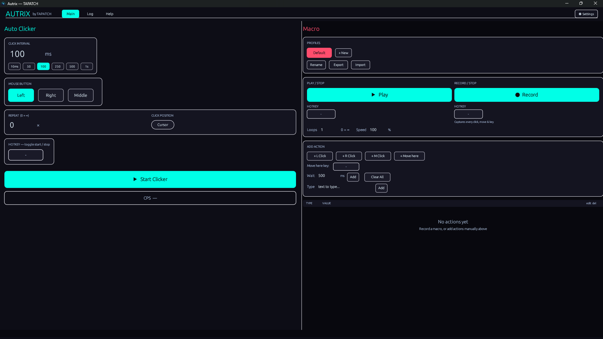

# 🤖 Autrix

**Tested faster than every auto-clicker we benchmarked.**

> Benchmarked against the most downloaded auto-clickers. Autrix won.



---

## Download

**[⬇ Download Autrix v1.0.0](https://tapatch.com/tools/autrix)** — Free for personal use · Windows 10/11 · x64

| | |
|---|---|
| Version | 1.0.0 |
| Platform | Windows 10/11 |
| Architecture | x64 |
| Size | ~4 MB |
| Price | Free |
| License | Personal use |

---

## What it does

Autrix is a clean, capable automation tool for Windows. Record mouse clicks, key presses, delays, and scroll actions — then replay them on a hotkey from any window. Save multiple profiles for different workflows. Built with global hooks so triggering a macro never requires Autrix to be in focus.

---

## Features

**🖱️ Auto-clicker**
Click at any position at configurable intervals and counts. Left click, right click, or both — set it and run.

**⏺️ Macro recorder**
Record any sequence of mouse clicks, key presses, delays, and scrolls. Replay it exactly with one hotkey.

**⌨️ Global hotkeys**
Trigger any macro or auto-clicker profile from any window — no need to switch back to Autrix first.

**📋 Multiple profiles**
Save and switch between named profiles. Keep separate macros for different apps, games, or workflows.

**🎯 Action types**
Supports left click, right click, key press, text input, scroll, and timed delays — mix and match freely.

**🔄 Loop control**
Run any macro a fixed number of times or loop indefinitely. Stop instantly with your configured hotkey.

---

## Limitations

- Some applications with anti-cheat software or elevated security may block simulated inputs. Autrix cannot bypass these restrictions.

---

## Changelog

### v1.0.0 — Initial release
- Auto-clicker with interval and repeat count control
- Macro recorder capturing clicks, keys, scrolls, and delays
- Global hotkey registration for trigger and stop
- Multiple named profiles with save/load
- Action editor — add, remove, and reorder steps manually
- Loop mode — fixed count or infinite with hotkey stop

---

## Security

VirusTotal scan: **1 / 72 engines** — [View report](https://www.virustotal.com/gui/file/bbf885fe73bd2da8bacbfd4fca6098039b8f18a84fdccf4c125a76b199d0cf94/detection)

**SHA-256**
```
bbf885fe73bd2da8bacbfd4fca6098039b8f18a84fdccf4c125a76b199d0cf94
```

---

## Built with

Rust · egui · eframe · winapi

---

## License

Free for personal use. See [Terms](https://tapatch.com/terms/software) for full license.

---

**[tapatch.com](https://tapatch.com)** — Small tools, serious quality. Built solo, shipped with care.
