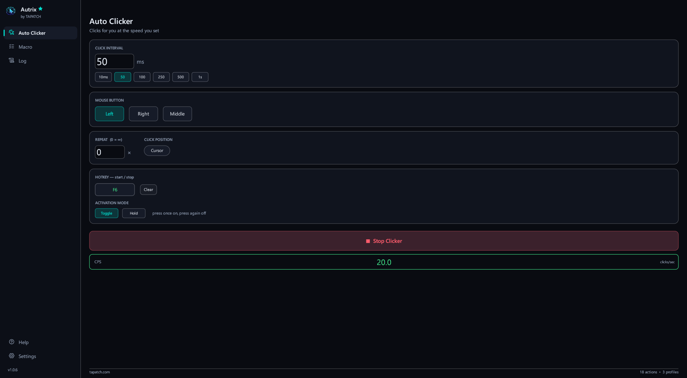
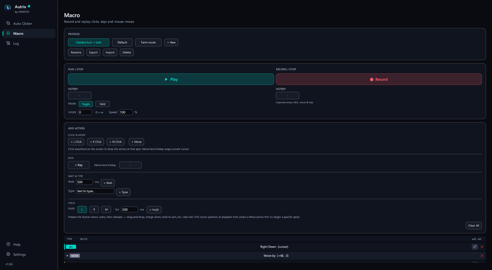
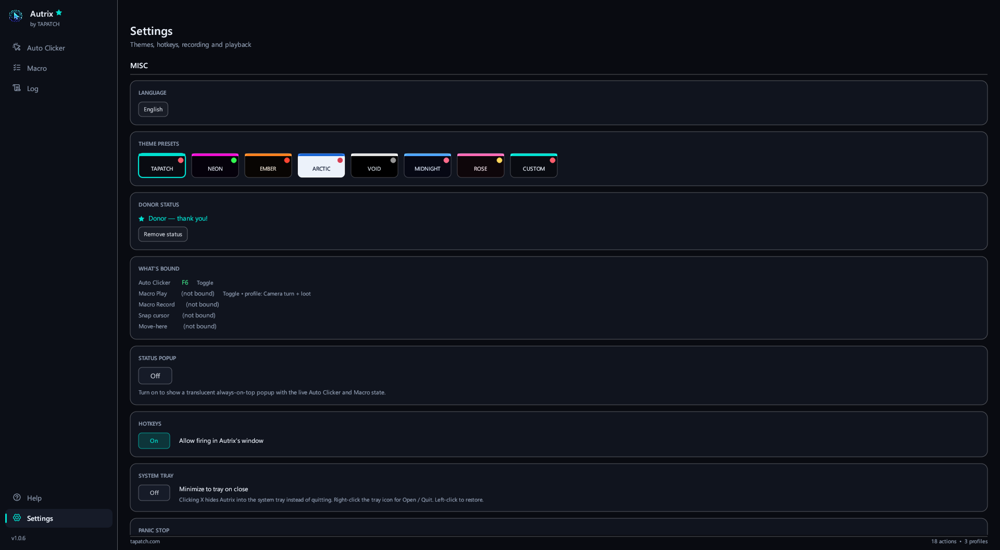
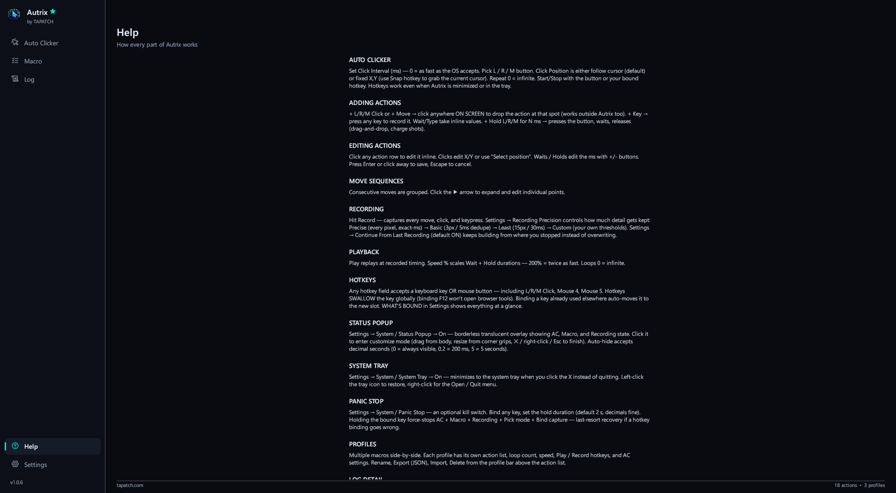

<p align="center"></p>
<h1 align="center">Autrix</h1>
<p align="center"><b>Tested faster than every auto-clicker we benchmarked.</b></p>
<p align="center">Auto-Clicker & Macro · Windows 10/11 · x64 · ~4 MB · Free for personal use</p>
<p align="center"><a href="https://github.com/tapatchUSA/Autrix/releases/latest"><b>⬇ Download Autrix 1.0.6</b></a> &nbsp;·&nbsp; <a href="https://tapatch.com/tools/autrix/">tapatch.com/tools/autrix</a></p>

<p align="center">
<br>
 <br>

</p>

> Benchmarked against the most downloaded auto-clickers. Autrix won.

## What it does

Autrix is a clean, capable automation tool for Windows. Record mouse clicks, key presses, delays, text input, mouse moves, and timed hold actions — then replay them on a hotkey from any window. The recorder now captures input exactly: button and key holds, click-and-drags, and keys held down across other actions are all reproduced with millisecond timing — set it up right and it can run a full game parkour sequence on its own. Save multiple profiles, edit actions inline, tune recording precision per-session, customize the always-on-top status popup, and push click rates past 1000 CPS.

## Features

A full automation suite. Way more than what's listed here.

**🖱️ Auto-clicker**  
1000+ CPS at TIME_CRITICAL priority. Configurable interval, L/R/M button, fixed-point or follow-cursor target, optional repeat count, instant Start/Stop hotkey.

**⏺️ Macro recorder**  
Captures every mouse move, click, keypress with sub-ms-rounded timing. Append-or-replace toggle keeps long sessions building across multiple takes.

**🎮 Exact capture**  
Records every press AND release — hold a button and drag, or hold a key while turning and jumping, and it replays exactly as you did it, to the millisecond. Set it up right and it can run a full game parkour route. Held inputs auto-release on Stop so nothing sticks.

**🎚️ Recording precision**  
Precise / Basic / Least / Custom — pick how much micro-detail to keep. Precise keeps every move + 1 ms timing for frame-tight sequences; Custom exposes min-move distance, drop-wait threshold, and wait-round granularity.

**⌨️ Global hotkeys**  
Any keyboard key OR mouse button (L/R/M, M4, M5). Conflicts auto-resolve. Toggle or Hold activation per slot. Works while Autrix is minimized or in the tray.

**✋ Hold action**  
Press a mouse button down for an exact duration — drag-and-drop, charge shots, hold-to-aim. Uses live cursor at playback so chains cleanly with Move.

**🎯 Pick coordinates**  
Click "+ Move" or "+ L/R/M Click" — then click anywhere on screen (Autrix, browser, game) to drop the action at that exact spot. Right-click or Esc cancels.

**📋 Profiles + JSON I/O**  
Multiple named profiles with separate action lists, loops, speeds, and hotkeys. Import/export as JSON with size + action caps to keep imports safe.

**💬 Status popup**  
Borderless translucent always-on-top overlay showing AC / Macro / Recording state. Theme-driven colors, fade-in/out, click to enter customize mode.

**🗄️ System tray**  
Optional minimize-to-tray on close. Left-click tray to restore, right-click for Open / Quit menu. Window can be hidden completely while everything keeps running.

**⛔ Panic stop**  
Hold a bound key for a configurable duration (default 2s) to force-kill AC + Macro + Recording + Pick + Bind. Last-resort recovery if a binding goes wrong.

## Limitations

- Some applications with anti-cheat software or elevated security may block simulated inputs. Autrix cannot bypass these restrictions.

## What's new in 1.0.6

- Cleaner new look: icon sidebar, sharper text and calmer colors
- Start and stop are instant at every click interval. Before, a long interval (like 10 seconds) made the hotkey wait for the next click before it stopped
- Shows your clicks per second the moment you start, and for intervals of a second or more a "next click in" countdown with a progress bar
- Macros copy camera turns in games exactly. In games that hold the cursor still, like Roblox when you hold right-click and drag, Autrix now records your mouse's own movement and plays it back the same way
- The Start / Stop buttons respond to your click right away
- Holding the hotkey a little too long no longer switches the clicker straight back off
- Recording no longer captures every mouse press and release twice, and older recordings with doubles play back correctly
- Clicks land on the exact pixel, Enter replays as the main Enter key, and Windows, Menu, Print Screen and media keys replay correctly
- Settings are saved safely, and deleting a profile asks for a second click

Release notes for every version are on the [Releases](https://github.com/tapatchUSA/Autrix/releases) page.

## Install

1. Download **Autrix-Setup-1.0.6.exe** from the [latest release](https://github.com/tapatchUSA/Autrix/releases/latest) or from [tapatch.com](https://tapatch.com/tools/autrix/).
2. Run it. The installer and the app come in 10 languages.
3. Accept the Terms of Service on first launch.

Windows may show a SmartScreen warning for new downloads. Click **More info → Run anyway**.

Or with [Scoop](https://scoop.sh):

```powershell
scoop bucket add tapatch https://github.com/tapatchUSA/packages
scoop install tapatch/autrix
```

## All versions

| Version | Released | Installer | VirusTotal | SHA-256 |
|---|---|---|---|---|
| [1.0.6](https://github.com/tapatchUSA/Autrix/releases/tag/v1.0.6) | 2026-10-02 | [Autrix-Setup-1.0.6.exe](https://github.com/tapatchUSA/Autrix/releases/download/v1.0.6/Autrix-Setup-1.0.6.exe) | [1 / 69](https://www.virustotal.com/gui/file/39c46005a46741c4efcc6ceeb289c381702fd98e999bc73b9f8d2fb819389721/detection) | `39c46005a46741c4…` |
| [1.0.5](https://github.com/tapatchUSA/Autrix/releases/tag/v1.0.5) | 2026-10-01 | [Autrix-Setup-1.0.5.exe](https://github.com/tapatchUSA/Autrix/releases/download/v1.0.5/Autrix-Setup-1.0.5.exe) | [1 / 71](https://www.virustotal.com/gui/file/9b801adc398a3c1e0ae818b1bf771b11325616d9216f048d63f2a582ab5c37fe/detection) | `9b801adc398a3c1e…` |
| [1.0.4](https://github.com/tapatchUSA/Autrix/releases/tag/v1.0.4) | 2026-09-30 | [Autrix-Setup-1.0.4.exe](https://github.com/tapatchUSA/Autrix/releases/download/v1.0.4/Autrix-Setup-1.0.4.exe) | [1 / 71](https://www.virustotal.com/gui/file/1c9e6ea7ed3520c95ebb164586c9fc1081c0b35afd0332b26bd18491702af105/detection) | `1c9e6ea7ed3520c9…` |
| [1.0.3](https://github.com/tapatchUSA/Autrix/releases/tag/v1.0.3) | 2026-09-16 | [Autrix-Setup-1.0.3.exe](https://github.com/tapatchUSA/Autrix/releases/download/v1.0.3/Autrix-Setup-1.0.3.exe) | [1 / 67](https://www.virustotal.com/gui/file/1b26708c66cb64e3b5a7960f6f94920c54a2149002573186994aaca42b09d401/detection) | `1b26708c66cb64e3…` |
| [1.0.2](https://github.com/tapatchUSA/Autrix/releases/tag/v1.0.2) | 2026-05-26 | [Autrix-Setup-1.0.2.exe](https://github.com/tapatchUSA/Autrix/releases/download/v1.0.2/Autrix-Setup-1.0.2.exe) | [1 / 71](https://www.virustotal.com/gui/file/ea75679defe1fed794ec57eaf78b3bdcd908e769488ffa4b604665cc914826f0/detection) | `ea75679defe1fed7…` |
| [1.0.1](https://github.com/tapatchUSA/Autrix/releases/tag/v1.0.1) | 2026-05-26 | [Autrix-Setup-1.0.1.exe](https://github.com/tapatchUSA/Autrix/releases/download/v1.0.1/Autrix-Setup-1.0.1.exe) | [1 / 71](https://www.virustotal.com/gui/file/101625995bcdbd89278720f2bae5daa38a346c75a605fc1ad09fb4aa4a0f32a1/detection) | `101625995bcdbd89…` |
| [1.0.0](https://github.com/tapatchUSA/Autrix/releases/tag/v1.0.0) | 2026-04-11 | [Autrix-Setup-1.0.0.exe](https://github.com/tapatchUSA/Autrix/releases/download/v1.0.0/Autrix-Setup-1.0.0.exe) | [1 / 72](https://www.virustotal.com/gui/file/bbf885fe73bd2da8bacbfd4fca6098039b8f18a84fdccf4c125a76b199d0cf94/detection) | `bbf885fe73bd2da8…` |

## Security

Every installer is scanned on VirusTotal before release. Autrix 1.0.6: **1 / 69** engines flag it · [view report](https://www.virustotal.com/gui/file/39c46005a46741c4efcc6ceeb289c381702fd98e999bc73b9f8d2fb819389721/detection)

**SHA-256**
```
39c46005a46741c4efcc6ceeb289c381702fd98e999bc73b9f8d2fb819389721
```

## Built with

Rust · egui · eframe · winapi

## License

Free for personal use. Business or commercial use requires a paid license (see [tapatch.com/terms](https://tapatch.com/terms/)). Full terms: [tapatch.com/terms/software](https://tapatch.com/terms/software/).

This repository holds the official installers and release notes.

---

**[tapatch.com](https://tapatch.com)**: small tools, serious quality. Built solo, shipped with care.
